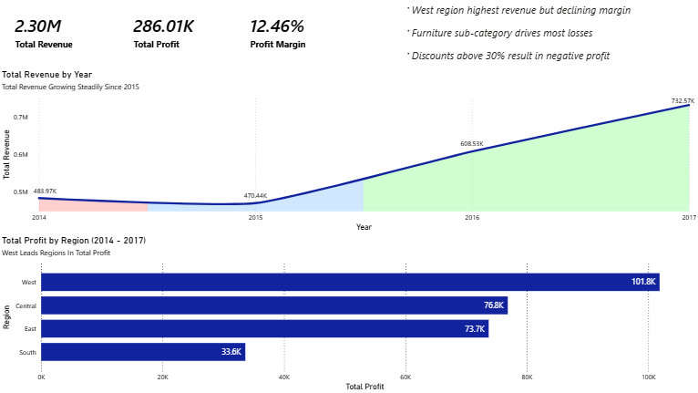

# Superstore Sales Analysis

SQL • PostgreSQL • Power BI

## Overview

This project explores retail sales data from a fictional Superstore to identify trends in revenue, profitability, and customer behavior.

The goal was to simulate a real-world data analysis workflow: designing a relational database, transforming raw transactional data with SQL, and building an interactive Power BI dashboard to highlight key business insights.

The dataset contains orders, products, customers, and financial metrics such as sales, discount, and profit.

---

## Tools Used

* **PostgreSQL** – relational database for storing and querying data
* **SQL** – data transformation and analysis
* **Power BI** – interactive dashboards and visual analytics
* **DataGrip** – database management and query development

---

## Database Structure

The raw dataset was normalized into four tables to improve data organization and query performance.

Tables created:

* `customers` – customer details and geographic information
* `products` – product categories and product names
* `orders` – order-level information including shipping data
* `order_details` – transactional sales data for each product within an order

Relationship structure:

customers → orders → order_details → products

This structure allows analysis at multiple levels including customer, region, product category, and individual order performance.

---

## Key Questions Explored

The analysis focused on answering several business questions:

* Which regions generate the highest revenue and profit?
* Which product categories are the most profitable?
* How do discounts impact profitability?
* Which customer segments contribute the most revenue?
* How does revenue change over time?
* Which customers generate the highest lifetime value?

---

## Key Insights

**Furniture generates negative profit margins**
Heavy discounting within the Furniture category leads to consistent losses despite strong sales.

**Technology is the most profitable category**
Technology products generate the highest margins and contribute significantly to overall profit.

**Regional performance varies significantly**
Some regions generate strong revenue but lower profit margins, suggesting pricing or discount strategy differences.

**Corporate customers produce higher order values**
The corporate segment tends to have higher average order values compared with consumer purchases.

---

## Dashboard

The Power BI dashboard provides an interactive view of the analysis, allowing exploration of revenue, profitability, and product performance.

Example dashboard views include:

* Sales and profit by region
* Profit margin by product category
* Customer segment analysis
* Monthly revenue trends



---

## SQL Analysis

SQL queries were used to perform aggregation and analytical calculations including:

* revenue and profit calculations
* margin analysis
* discount impact analysis
* monthly revenue growth using window functions
* customer lifetime value calculations

All SQL scripts used for database creation and analysis are included in the `sql` folder.

---

## Repository Structure

```
superstore-sales-analysis
│
├── data
│   superstore.csv
│
├── sql
│   schema.sql
│   data_import.sql
│   analysis_queries.sql
│
├── powerbi
│   superstore_dashboard.pbix
│
├── images
│   dashboard_overview.png
│
└── README.md
```

---

## Project Goal

This project was built as part of a data analytics portfolio to demonstrate practical skills in:

* relational database design
* SQL data analysis
* business insight generation
* data visualization with Power BI

The workflow mirrors a typical analytics pipeline used in many data-driven organizations.
